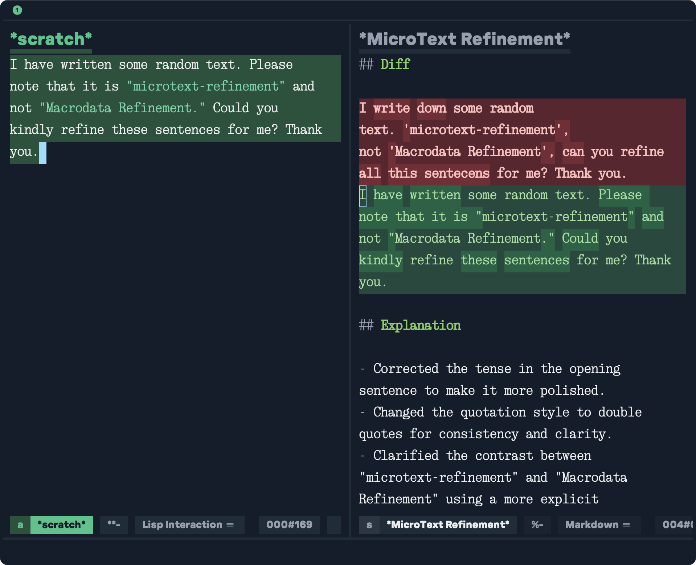

# microtext-refinement.el


A text refinement tool for Emacs powered by [gptel](https://github.com/karthink/gptel). You need to set up gptel before using microtext-refinement.

## Installation

Use your favorite remote source code installer with `use-package`, such as `quelpa`, `straight`, etc. Below is an example for Emacs 30+:

``` emacs-lisp
(use-package microtext-refinement
  :vc (:url "https://github.com/cxa/microtext-refinement"))
```

## Usage

Select a region that you need to refine, then use `M-x` to call `mtr-refine`. You can also bind a key to this command, for example:

``` emacs-lisp
(use-package microtext-refinement
  :vc (:url "https://github.com/cxa/microtext-refinement")
  :bind ("M-R" . mtr-refine))
```

## Options

- `mtr-gptel-backend`: The default value is `nil`, which means that `gptel-backend` will be used by default. For instructions on how to add a backend to meet your specific needs, please refer to [this link](https://github.com/karthink/gptel?tab=readme-ov-file#other-llm-backends).
- `mtr-prompt-role`: Inform the LLM of your requirements. Feel free to customize if you have additional specific needs.
- `mtr-explanation-lang`: In which language should the explanation be provided? The default is English.